---
## Front matter
lang: ru-RU
title: Лабораторная работа №1
subtitle: Операционные системы
author:
  - Дворкина Е. В., НКАбд-01-22
institute:
  - Российский университет дружбы народов, Москва, Россия
date: 18 февраля 2023

## i18n babel
babel-lang: russian
babel-otherlangs: english

## Formatting pdf
toc: false
toc-title: Содержание
slide_level: 2
aspectratio: 169
section-titles: true
theme: metropolis
header-includes:
 - \metroset{progressbar=frametitle,sectionpage=progressbar,numbering=fraction}
 - '\makeatletter'
 - '\beamer@ignorenonframefalse'
 - '\makeatother'
---

## Цель работы

Целью данной работы является приобретение практических навыков установки операционной системы на виртуальную машину, настройки минимально необходимых для дальнейшей работы сервисов.

## Задание

1. Создание виртуальной машины
2. Установка операционной системы
3. Работа с операционной системой после установки
4. Установка программного обеспечения для создания документации
5. Дополнительные задания

## Создание виртуальной машины

Cоздаю новую виртуальную машину, указываю ее имя, путь к папке машины по умолчанию меня устраивает, выбираю тип ОС и версию (рис. 1).

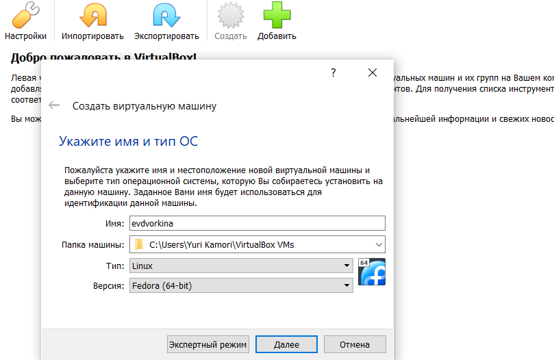{#fig:001 width=60%}

## Создание виртуальной машины

Указываю объем основной памяти виртуальной машины размером 4096МБ (рис. 2).

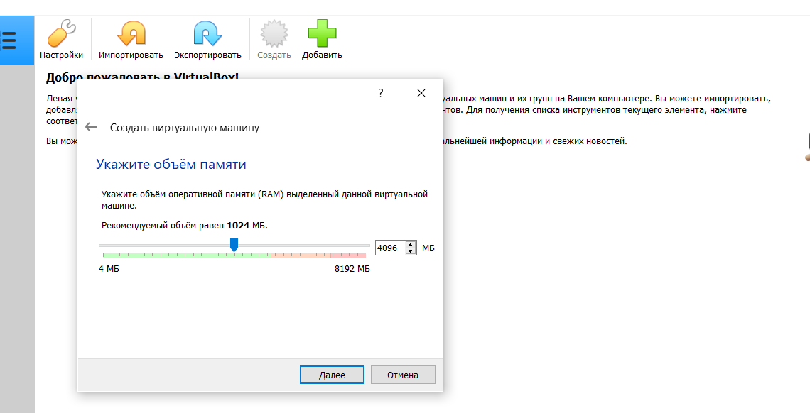{#fig:002 width=60%}

## Создание виртуальной машины

Задаю конфигурацию жесткого диска: загрузочный VDI (рис. 3).

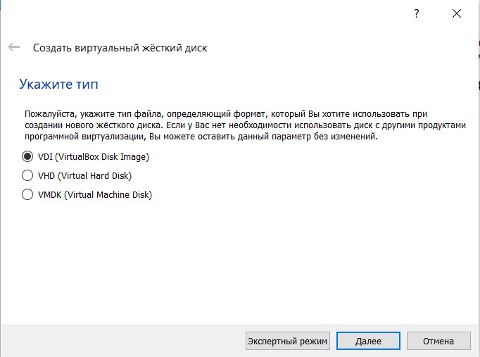{#fig:003 width=55%}

## Создание виртуальной машины

Задаю размер диска - 80 ГБ, оставляю расположение жесткого диска по умолчанию (рис. 4).

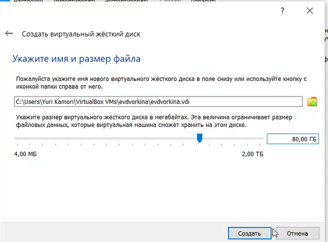{#fig:004 width=55%}

## Создание виртуальной машины

Выбираю динамический виртуальный жесткий диск при указании формата хранения (рис. 5).

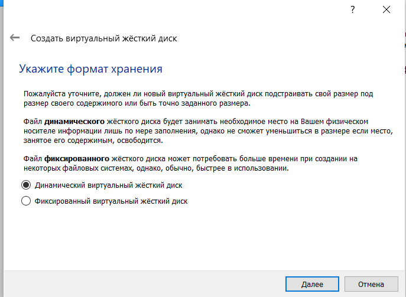{#fig:005 width=60%}

## Создание виртуальной машины

В "Носителях" добавляю новый привод оптических дисков и выбираю скачанный образ операционной системы Fedora (рис. 6).

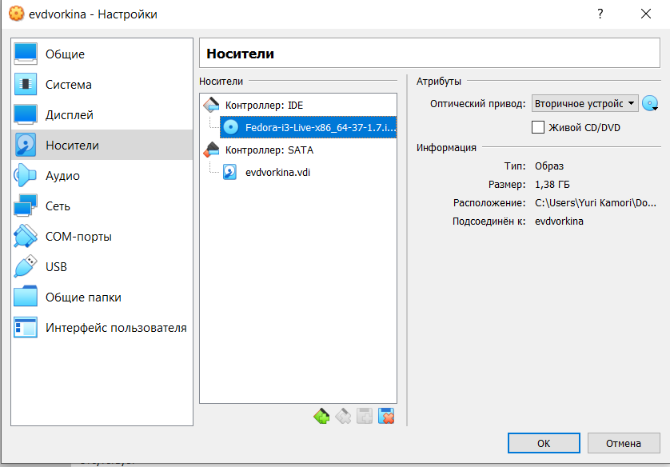{#fig:006 width=55%}

## Установка операционной системы

Запускаю созданную виртуальную машину для установки.

Вижу интерфейс начальной конфигурации. Нажимаю Enter для создания конфигурации по умолчанию (рис. 7).

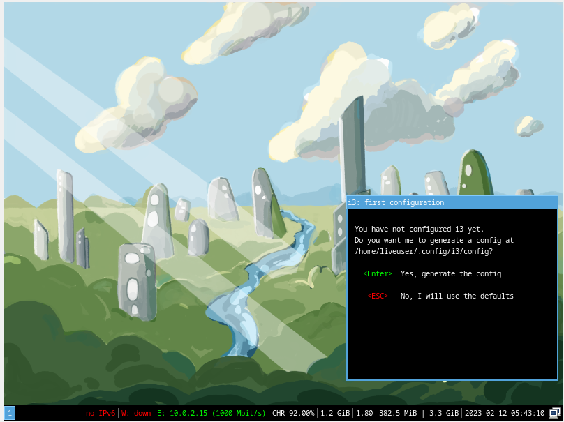{#fig:007 width=55%}

## Установка операционной системы

Нажимаю Win+Enter для запуска терминала. В терминале запускаю liveinst (рис. 8).

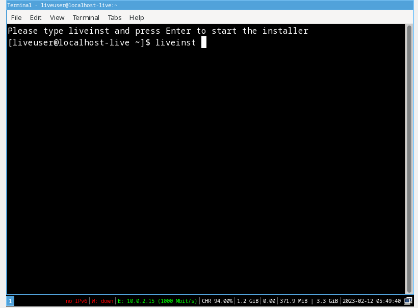{#fig:008 width=55%}

## Установка операционной системы

- Выбираю язык для использования в процессе установки русский
- Раскладку клавиатуры выбираю и русскую, и английскую.
- Корректирую часовой пояс, чтобы время на виртуальной машине совпадало с временем в моем регионе.
- Проверяю место установки и сохраняю значение по умолчанию (рис. 9).

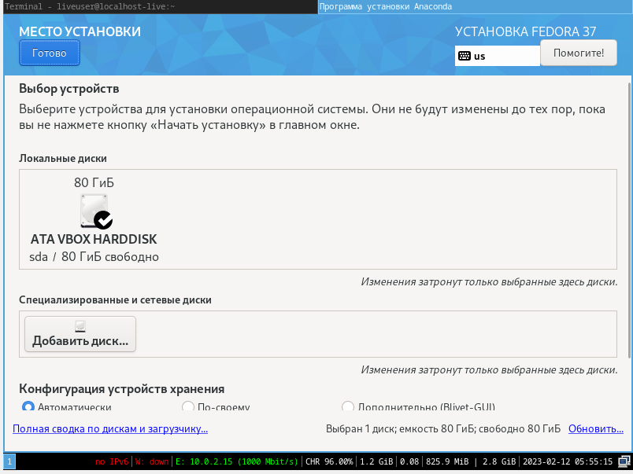{#fig:009 width=50%}

## Установка операционной системы

Задаю сетевое имя компьютера в соответствии с соглашением об именовании (рис. 10).

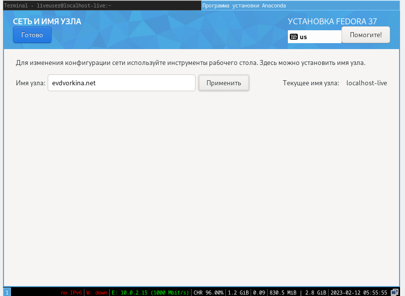{#fig:010 width=60%}

## Установка операционной системы

Создаю аккаунт администратора и создаю пароль для супер-пользователя (рис. 11).

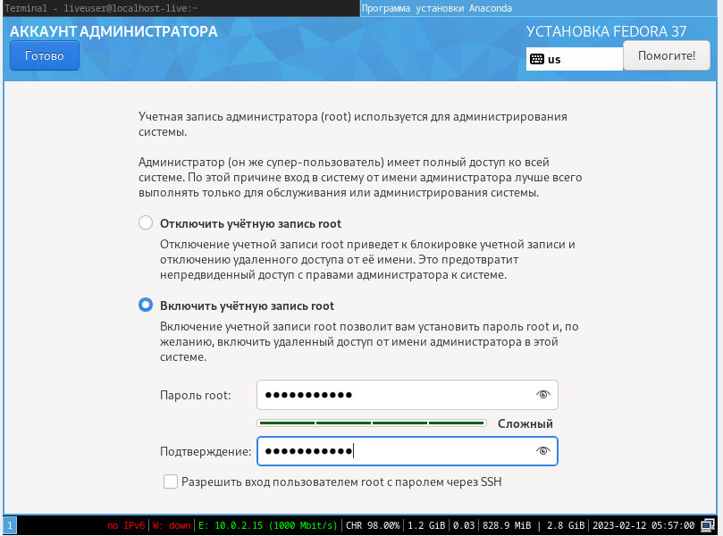{#fig:011 width=55%}

## Установка операционной системы

Создаю пользователя (рис. 12).

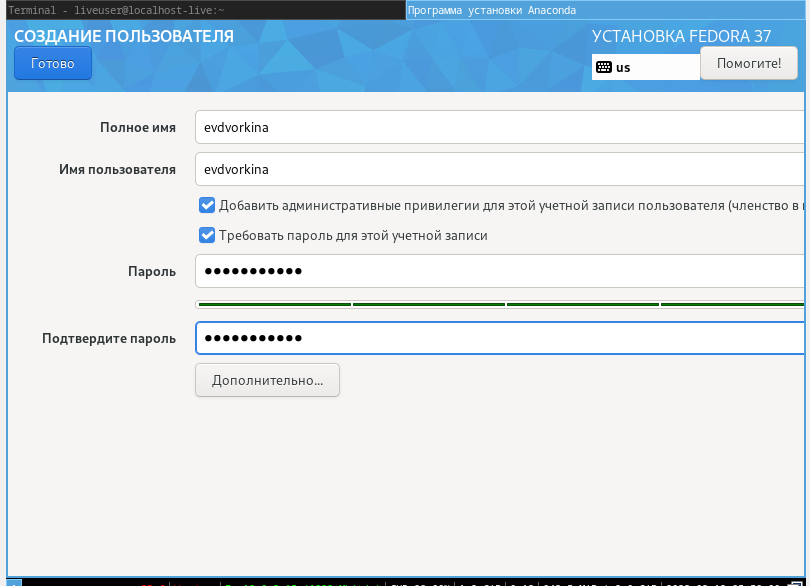{#fig:012 width=60%}

## Установка операционной системы

- Операционная система устанавливается. После установки нажимаю "завершить установку".
- Отключаю носитель информации с образом.
- Носитель информации с образом отключен (рис. 13).

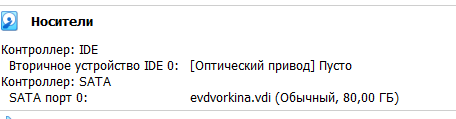{#fig:013 width=70%}

## Работа с операционной системой после установки

- Запускаю виртуальную машину.
- Вхожу в ОС под заданной мной при установке учетной записью .
- Открываю терминал.
- Обновляю все пакеты (рис. 14).

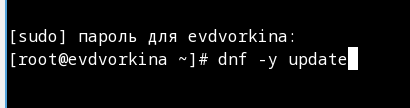{#fig:014 width=70%}

## Работа с операционной системой после установки

Устанавливаю программы для удобства работы в консоли: tmux и mc (рис. 15).

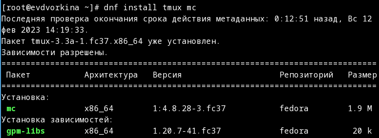{#fig:015 width=70%}

## Работа с операционной системой после установки

Устанавливаю программы для автоматического обновления (рис. 16).

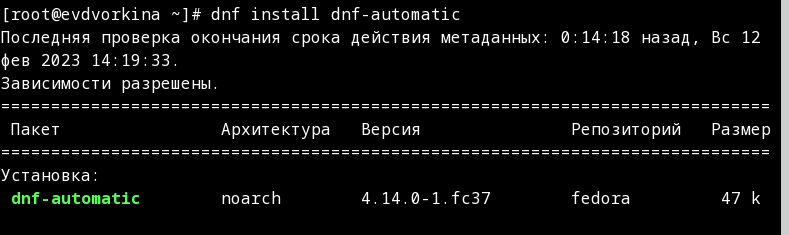{#fig:016 width=70%}

## Работа с операционной системой после установки

Запускаю таймер (рис. 17).

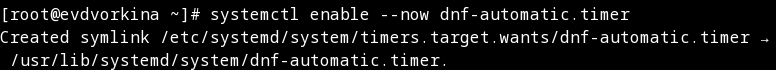{#fig:017 width=70%}

## Работа с операционной системой после установки

- Перемещаюсь в директорию /etc/selinux, открываю mc, ищу нужный файл.
- Изменяю открытый файл: SELINUX=enforcing меняю на значение SELINUX=permissive (рис. 18).

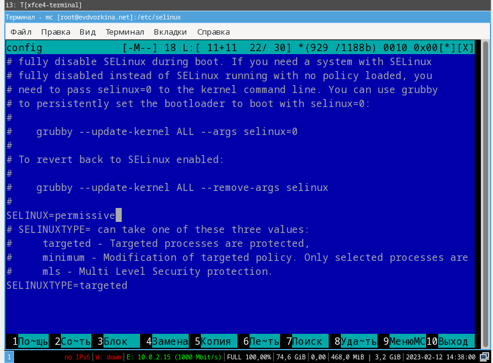{#fig:018 width=50%}

## Работа с операционной системой после установки

- Переключаюсь на роль супер-пользователя.
- Устанавливаю пакет dkms (рис. 19).

{#fig:019 width=70%}

## Работа с операционной системой после установки

В меню виртуальной машины подключаю образ диска гостевой ОС и примонтирую диск с помощью утилиты mount (рис. 20).

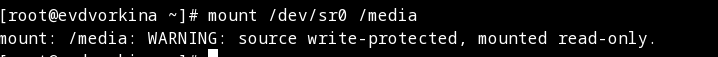{#fig:020 width=70%}

## Работа с операционной системой после установки

Устанавливаю драйвера (рис. 21).

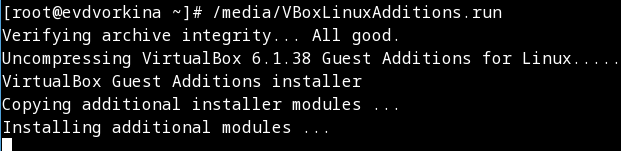{#fig:021 width=70%}

## Работа с операционной системой после установки

- Перехожу в директорию /tc/X11/xorg.conf.d, открываю mc для удобства, открываю файл 00-keyboard.conf.
- Редактирую конфигурационный файл (рис. 22).

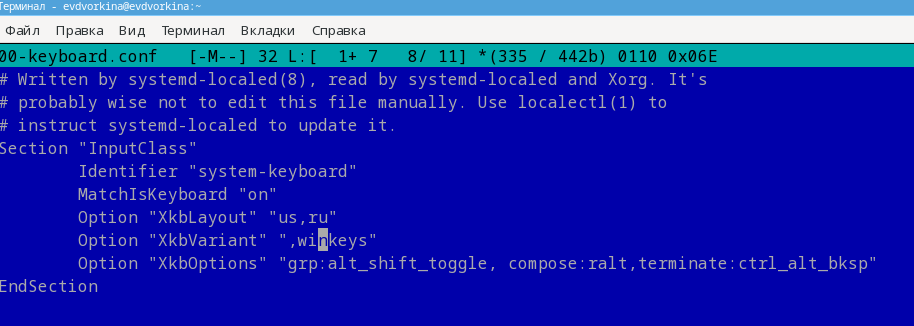{#fig:022 width=70%}

## Установка программного обеспечения для создания документации

Устанавливаю pandoc (рис. 23).

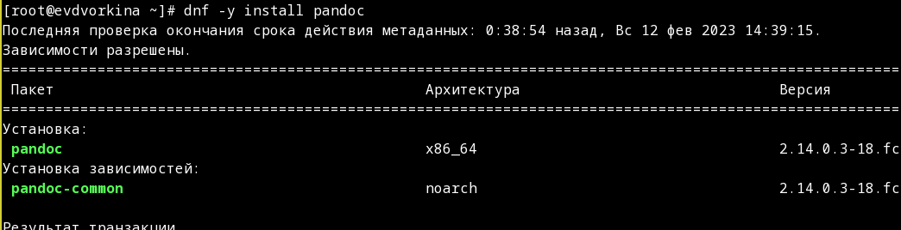{#fig:023 width=70%}

## Установка программного обеспечения для создания документации

Устанавливаю необходимые расширения для pandoc (рис. 24).

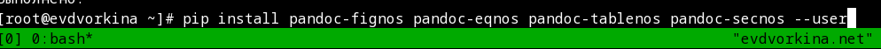{#fig:024 width=70%}

## Установка программного обеспечения для создания документации

Устанавливаю дистрибутив texlive (рис. 25).

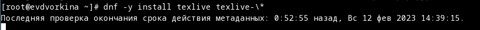{#fig:025 width=70%}

## Выводы

При выполнении данной лабораторной работы я приобрела практические навыки установки операционной системы на виртуальную машину, а так же сделала настройки минимально необходимых для дальнейшей работы сервисов.

## Выполнение дополнительного задания

Ввожу в терминале команду dmesg, чтобы проанализировать последовательность загрузки системы (рис. 26).

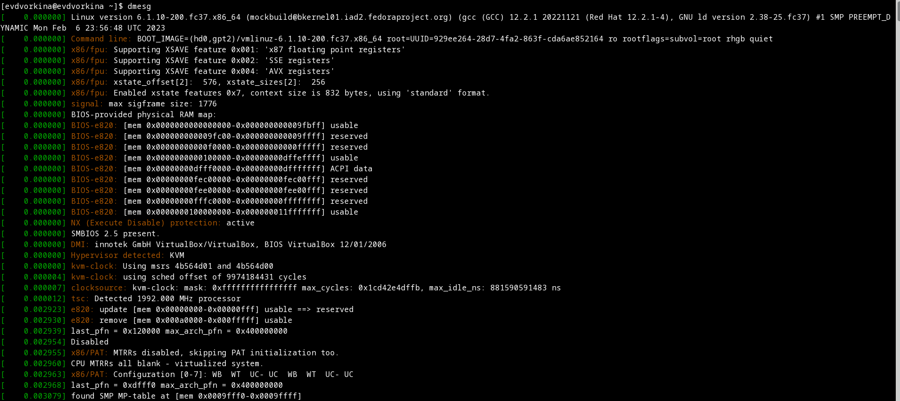{#fig:026 width=70%}

## Выполнение дополнительного задания

Ищу версию ядра Linux: 6.1.10-200.fc37.x86_64 (рис. 27).

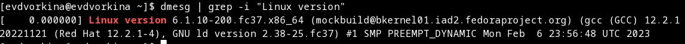{#fig:027 width=70%}

## Выполнение дополнительного задания

Оставила одно из ключевых слов и получила результат: 1992 Mhz (рис. 28).

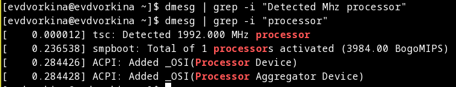{#fig:028 width=70%}

## Выполнение дополнительного задания

Аналогично ищу модель процессора (рис. 29).

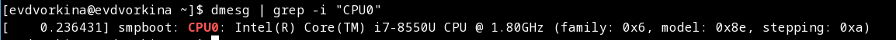{#fig:029 width=70%}

## Выполнение дополнительного задания

Объем доступной оперативной памяти ищу аналогично поиску частоты процессора (рис. 30).

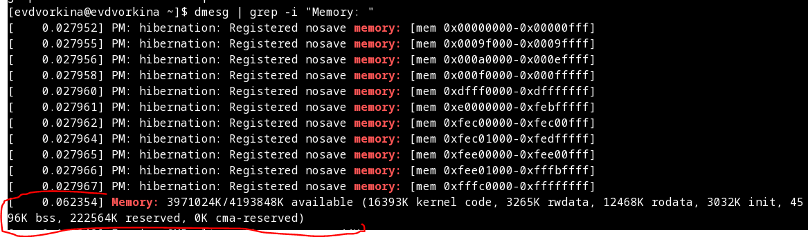{#fig:032 width=70%}

## Выполнение дополнительного задания

Нахожу тип обнаруженного гипервизора (рис. 31).

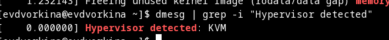{#fig:032 width=70%}

## Выполнение дополнительного задания

Тип файловой системы корневого раздела можно посомтреть с помощью утилиты fdisk (рис. 33).

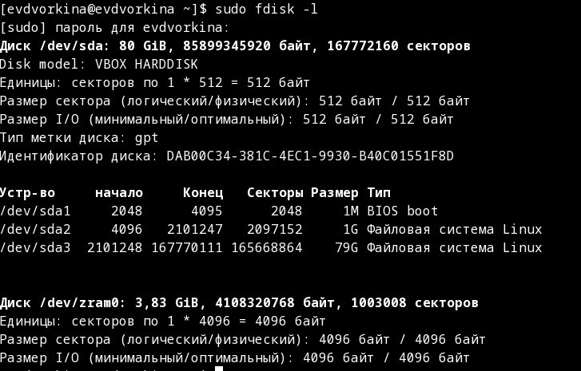{#fig:033 width=65%}

## Выполнение дополнительного задания

Последовательность монтирования файловых систем можно посмотреть, введя в поиск по результату dmesg слово mount (рис. 36).

{#fig:036 width=70%}

## Список литературы{.unnumbered}

::: {#refs}
1. Dash P. Getting started with oracle vm virtualbox. Packt Publishing Ltd, 2013. 86 p.
2. Colvin H. Virtualbox: An ultimate guide book on virtualization with virtualbox. CreateSpace Independent Publishing Platform, 2015. 70 p.
3. van Vugt S. Red hat rhcsa/rhce 7 cert guide : Red hat enterprise linux 7 (ex200 and ex300). Pearson IT Certification, 2016. 1008 p.
4. Робачевский А., Немнюгин С., Стесик О. Операционная система unix. 2-е изд. Санкт-Петербург: БХВ-Петербург, 2010. 656 p.
5. Немет Э. et al. Unix и Linux: руководство системного администратора. 4-е изд. Вильямс, 2014. 1312 p.
6. Колисниченко Д.Н. Самоучитель системного администратора Linux. СПб.: БХВ-Петербург, 2011. 544 p.
7. Robbins A. Bash pocket reference. O’Reilly Media, 2016. 156 p.

:::
