---
## Front matter
lang: ru-RU
title: Лабораторная работа №9
subtitle: Операционные системы
author:
  - Дворкина Ева Владимировна
institute:
  - Российский университет дружбы народов, Москва, Россия

date: 20 марта 2023

## i18n babel
babel-lang: russian
babel-otherlangs: english

## Formatting pdf
toc: false
toc-title: Содержание
slide_level: 2
aspectratio: 169
section-titles: true
theme: metropolis
header-includes:
 - \metroset{progressbar=frametitle,sectionpage=progressbar,numbering=fraction}
 - '\makeatletter'
 - '\beamer@ignorenonframefalse'
 - '\makeatother'
---

## Докладчик

:::::::::::::: {.columns align=center}
::: {.column width="70%"}

  * Дворкина Ева Владимировна
  * студентка из группы НКАбд-01-22
  * Факультет физико-математических и естественных наук
  * Российский университет дружбы народов
  * [1132226447@rudn.ru](mailto:1132226447@rudn.ru)
  * <https:///evdvorkina.github.io>

:::
::: {.column width="30%"}

:::
::::::::::::::

## Цель работы

Цель данной лабораторной работы - познакомиться с операционной системой Linux. Получить практические навыки работы с редактором Emacs.

## Выполнение лабораторной работы

Создаю файл ab07.sh с помощью комбинации Ctrl-x Ctrl-f

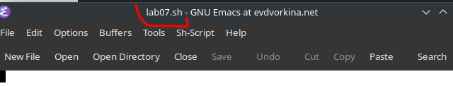

## Выполнение лабораторной работы

Прописываю в файле текст программы

## Выполнение лабораторной работы

Сохраняю файл с помощью комбинации C-x C-s

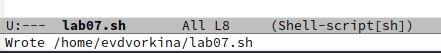

## Выполнение лабораторной работы

Вырезаю одной командой целую строку (С-k)

## Выполнение лабораторной работы

Вставляю эту строку в конец файла (C-y)

## Выполнение лабораторной работы

Выделияю область текста (C-space), копирую область в буфер обмена (M-w), вырезаю эту область с помощью C-w

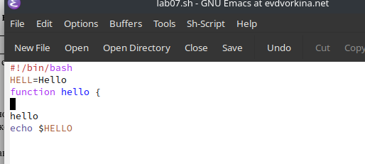

## Выполнение лабораторной работы

Вставляю область в конец файла (С-у)

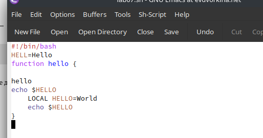

## Выполнение лабораторной работы

Отменяю последнее действие С-/

## Выполнение лабораторной работы

Перевожу курсор в начало строки С-а

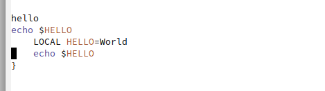

## Выполнение лабораторной работы

Перемещаю курсор в конец строки С-е

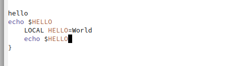

## Выполнение лабораторной работы

Перемещаю курсор в начало файла М-<

## Выполнение лабораторной работы

Перемещаю курсор в конец файла M->

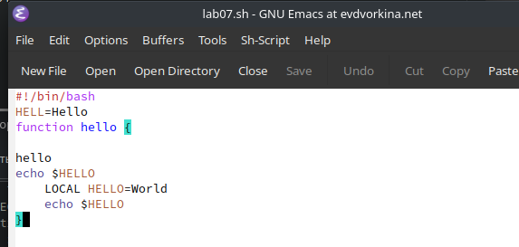

## Выполнение лабораторной работы

Открываю список активных буферов в другом окне C-x C-b

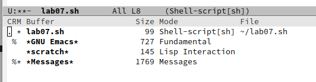

## Выполнение лабораторной работы

Переключаюсь на другой буфер C-x o

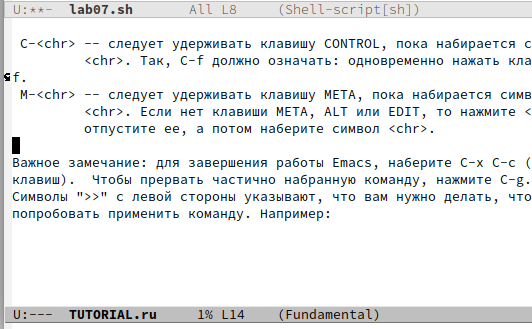

## Выполнение лабораторной работы

Делю фрейм на 4 части: сначала на два окна по вертикали (C-x 3),
а затем каждое из этих окон на две части по горизонтали (C-x 2)

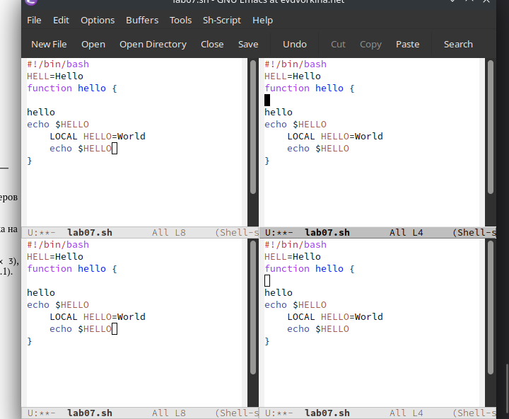

## Выполнение лабораторной работы

В каждом из четырех созданных окон с помощью C-x b открыла разные буферы и.

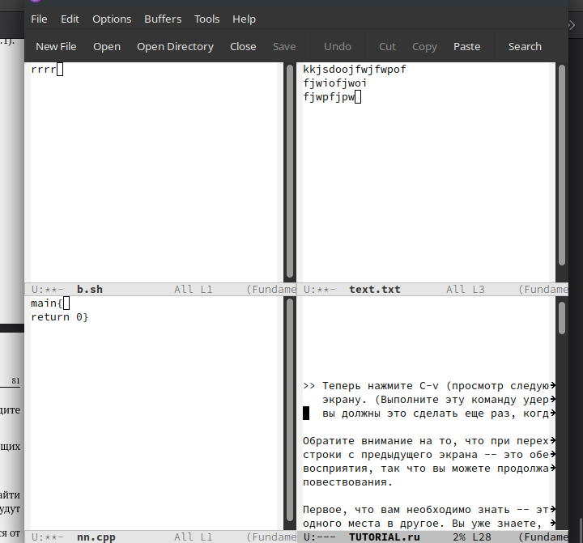

## Выполнение лабораторной работы

Перехожу в режим поиска с помощью C-s, ищу слова в тексте, они подсвечиваются.

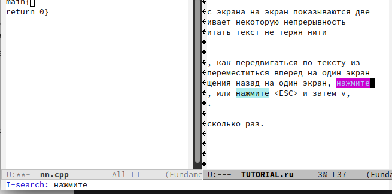

## Выполнение лабораторной работы

Перехожу в режим поиска и замены с помощью M-%, ввожу какое слово хочу заменить, затем ввожу на какое хочу заменить.

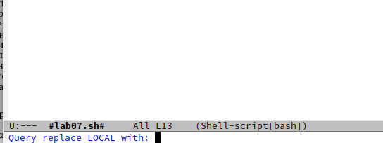

## Выполнение лабораторной работы

С помощью M+s перехожу в другой режим поиска. Он отличается от предыдущего тем, что выводит результат в отдельном окне от окна буфера.

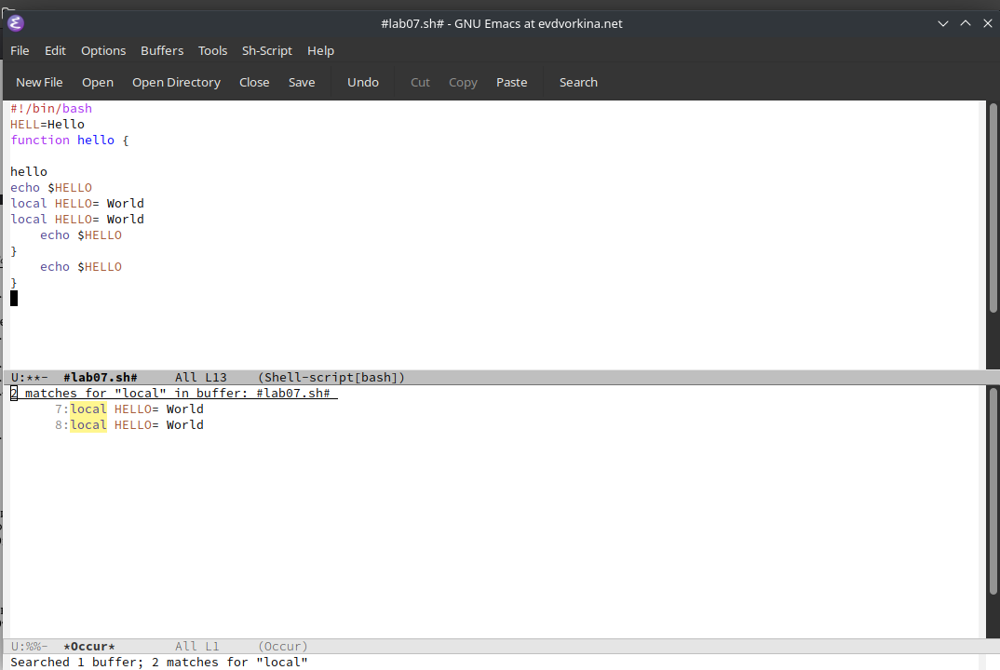

## Выводы

В ходе данной лаборатрной работы я познакомилась с операционной системой Linuх, получила практические навыки работы с редактором Emacs.

