---
## Front matter
lang: ru-RU
title: Лабораторная работа №13
subtitle: Операционные системы
author:
  - Дворкина Ева Владимировна
institute:
  - Российский университет дружбы народов, Москва, Россия

date: 31 марта 2023

## i18n babel
babel-lang: russian
babel-otherlangs: english

## Formatting pdf
toc: false
toc-title: Содержание
slide_level: 2
aspectratio: 169
section-titles: true
theme: metropolis
header-includes:
 - \metroset{progressbar=frametitle,sectionpage=progressbar,numbering=fraction}
 - '\makeatletter'
 - '\beamer@ignorenonframefalse'
 - '\makeatother'
---

## Докладчик

:::::::::::::: {.columns align=center}
::: {.column width="70%"}

  * Дворкина Ева Владимировна
  * студентка из группы НКАбд-01-22
  * Факультет физико-математических и естественных наук
  * Российский университет дружбы народов
  * [1132226447@rudn.ru](mailto:1132226447@rudn.ru)
  * <https:///evdvorkina.github.io>

:::
::: {.column width="30%"}

:::
::::::::::::::

## Цель работы

Цель данной лабораторной работы - приобрести простейшие навыки разработки, анализа, тестирования и отладки приложений в ОС типа UNIX/Linux на примере создания на языке программирования
С калькулятора с простейшими функциями

# Выполнение лабораторной работы

## Выполнение лабораторной работы

Создаю директорию ~/work/os/lab_prog, перехожу в нее и в этой директории создаю файлы calculate.h, calculate.c, main.c.

## Выполнение лабораторной работы

Это будет примитивнейший калькулятор, способный складывать, вычитать, умножать
и делить, возводить число в степень, брать квадратный корень, вычислять sin, cos, tan.
При запуске он будет запрашивать первое число, операцию, второе число. После этого
программа выведет результат и остановится.
- Реализация функций калькулятора в файле calculate.h
- Интерфейсный файл calculate.h, описывающий формат вызова функции-
калькулятора
- Основной файл main.c, реализующий интерфейс пользователя к калькулятору

## Выполнение лабораторной работы

Далее создаю Makefile. Исправляю Makefile:

    Для использования GDB необходимо скомпилировать анализируемый код программы
    таким образом, чтобы отладочная информация содержалась в результирующем бинарном
    файле. Для этого следует воспользоваться опцией -g компилятора gcc

В переменную CFLAGS добавляю значение -g

## Выполнение лабораторной работы

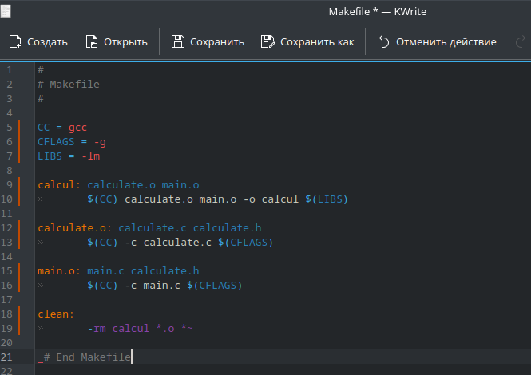

## Выполнение лабораторной работы

Использую make

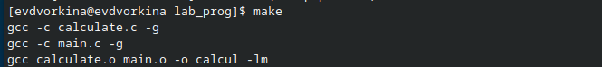

## Выполнение лабораторной работы

Запусткаю отладчик GDB, загрузив в него программу для отладки

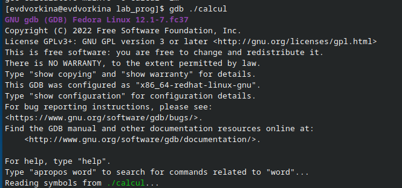

## Выполнение лабораторной работы

Для запуска программы внутри отладчика ввожу команду run

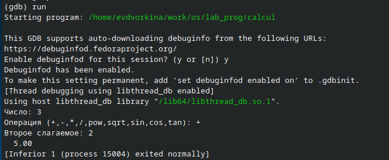

## Выполнение лабораторной работы

Для постраничного (по 9 строк) просмотра исходного кода использую команду list

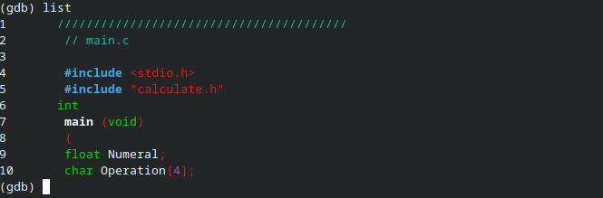

## Выполнение лабораторной работы

Для просмотра строк с 12 по 15 основного файла использую list с параметрами

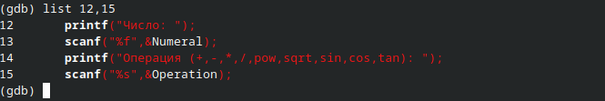

## Выполнение лабораторной работы

Устанавливаю точку остановки в файле calculate.c на строке номер 21 (break 21)

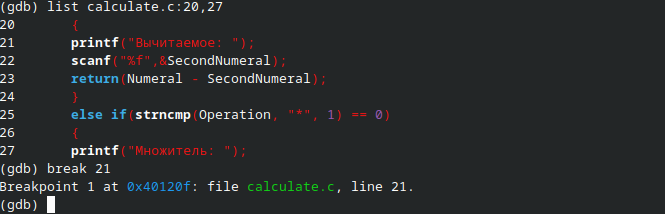

## Выполнение лабораторной работы

Вывожу информацию об имеющихся в проекте точках остановки

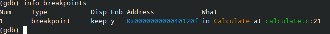

## Выполнение лабораторной работы

Запускаю программу внутри отладчика и убеждаюсь, что программа останавливается
в момент прохождения точки остановки:

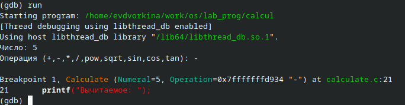

## Выполнение лабораторной работы

Команда backtrace покажет весь стек вызываемых функций от начала програм-
мы до текущего места

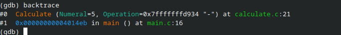

## Выполнение лабораторной работы

Смотрю, чему равно на этом этапе значение переменной Numeral, это можно сделать двумя способами. При первом я получу вывод значения переменной из bash-скрипта, второй способ более интуитивный, там значение соответствует переменной из кода на Си

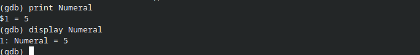

## Выполнение лабораторной работы

Удаляю точки остановки

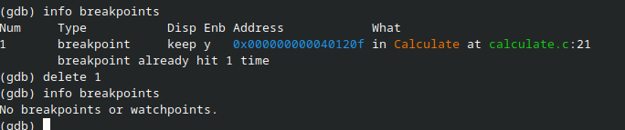

## Выполнение лабораторной работы

С помощью утилиты splint пробую проанализировать код файла main.c.

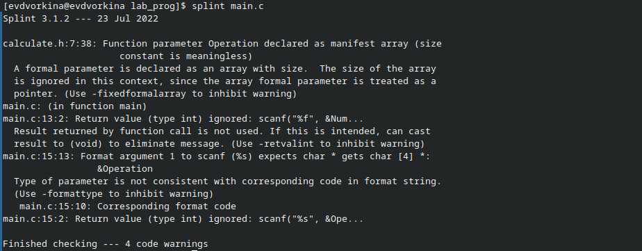

## Выводы

При выполнениии данной лабораторной работы я приобрела простейшие навыки разработки, анализа, тестирования и отладки приложений в ОС типа UNIX/Linux на примере создания на языке программирования
С калькулятора с простейшими функциями
