---
## Front matter
lang: ru-RU
title: Лабораторная работа 9
subtitle: Операционные системы
author:
  - ДЬяконова С.А.
institute:
  - Российский университет дружбы народов, Москва, Россия
date: 08 апрель 2023

## i18n babel
babel-lang: russian
babel-otherlangs: english

## Formatting pdf
toc: false
toc-title: Содержание
slide_level: 2
aspectratio: 169
section-titles: true
theme: metropolis
header-includes:
 - \metroset{progressbar=frametitle,sectionpage=progressbar,numbering=fraction}
 - '\makeatletter'
 - '\beamer@ignorenonframefalse'
 - '\makeatother'
---

# Информация

## Докладчик

:::::::::::::: {.columns align=center}
::: {.column width="70%"}

  * ДЬяконова Софья Александровна
  * студентка НКАбд-01-22
  * Российский университет дружбы народов
  * [1132220829@rudn.ru](mailto:1132220829@rudn.ru)
  * <https://sadjyakonova.github.io/ru/>

:::
::: {.column width="30%"}

:::
::::::::::::::

## Цель работы

Цель работы -- познакомиться с операционной системой Linux, получить практические навыки работы с редактором Emacs.

# Выполнение лабораторной работы

## emacs

Открываю emacs.

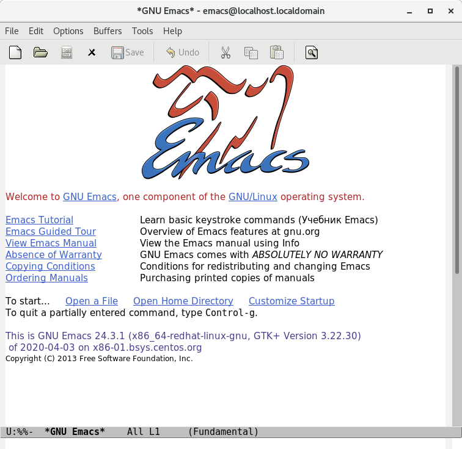

## lab07.sh

Создаю файл lab07.sh с помощью комбинации Ctrl-x Ctrl-f (C-x C-f).

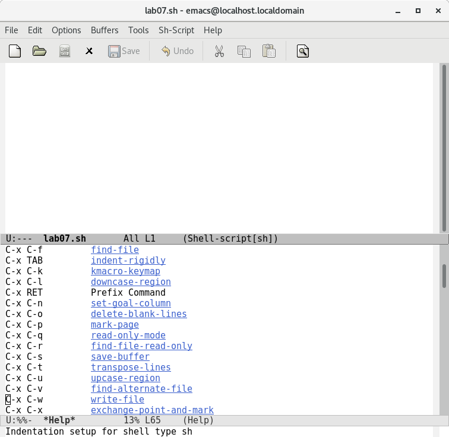

## hello

Набираю текст

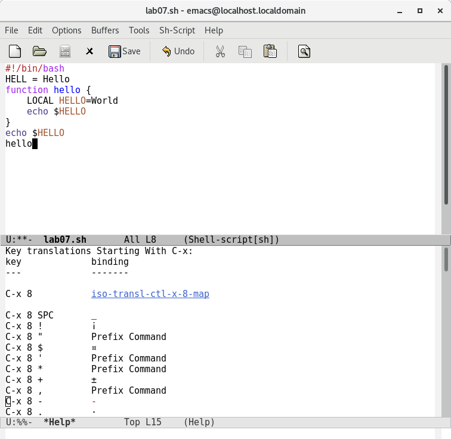

## Проделываю с текстом процедуры редактирования

каждое действие  осуществляется комбинацией клавиш.

## С-k

Вырезаю одной командой целую строку (С-k)

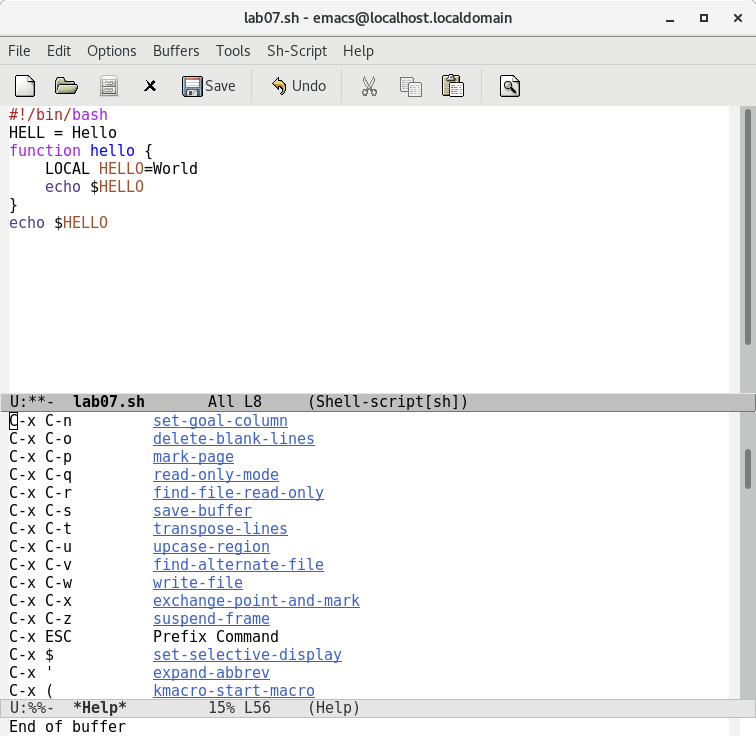

## С-y
Вставляю эту строку в конец файла (C-y)

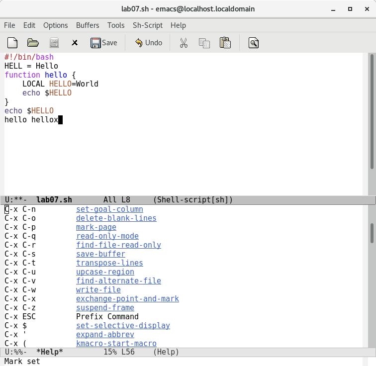

## Область в конце файла

Вставляю область в конец файла

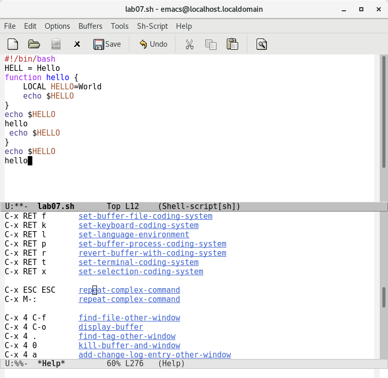

## С-w

Вновь выделяю эту область и на этот раз вырезаю её (C-w).

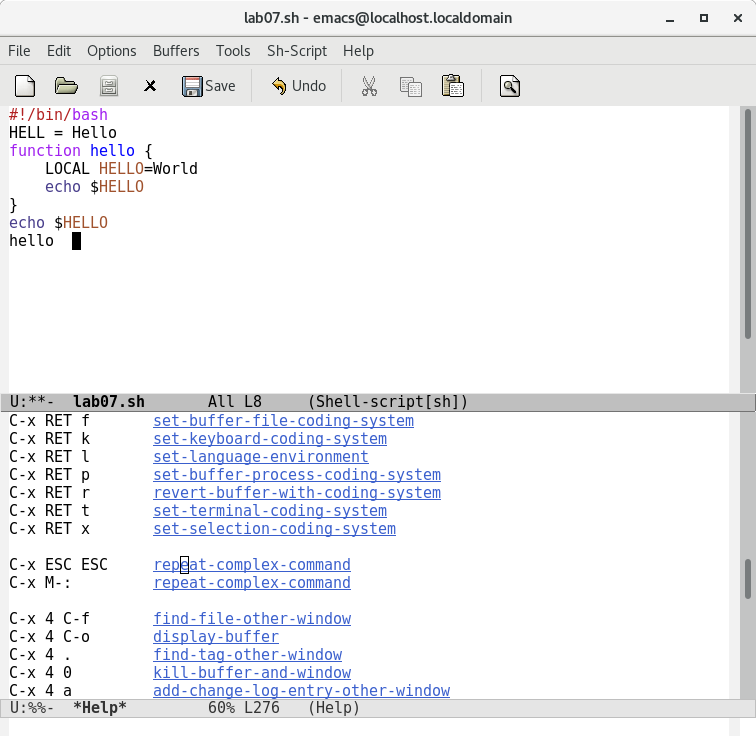

## С-/

Отменяю последнее действие (C-/)
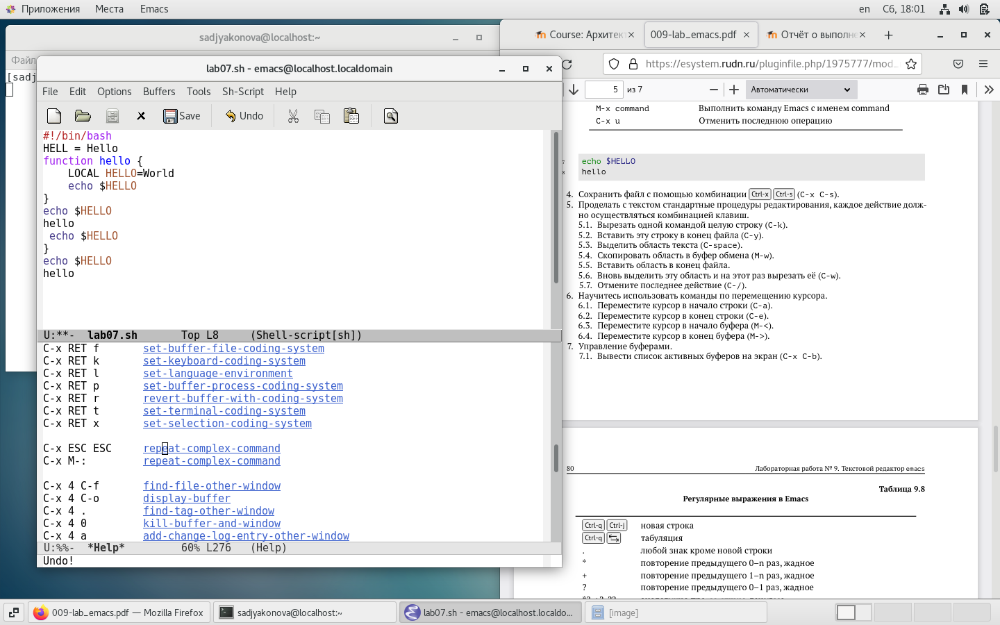

## Управление буферами

Вывожу список активных буферов на экран (C-x C-b).

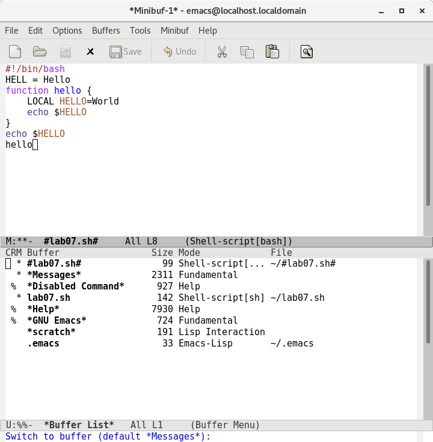

## Управление окнами

Делю фрейм на 4 части.

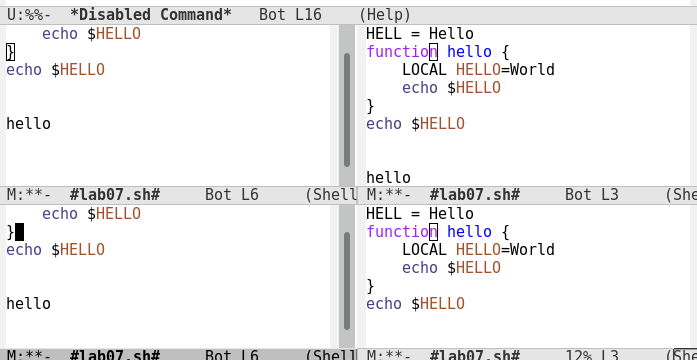

## Управление окнами

В каждом из четырёх созданных окон открываю новый буфер (файл) и ввожу несколько строк текста

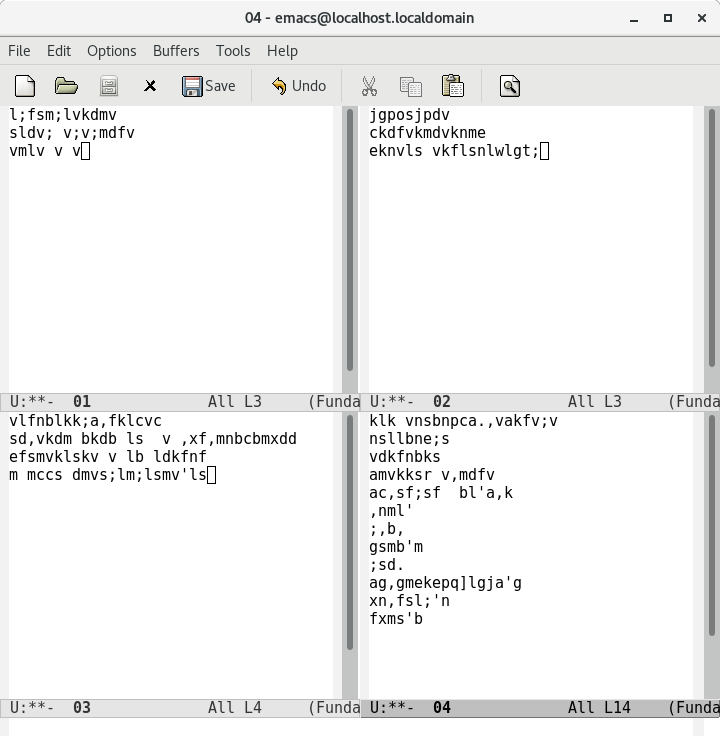

## Режим поиска

Переключаюсь в режим поиска (C-s) и нахожу несколько слов, присутствующих в тексте.
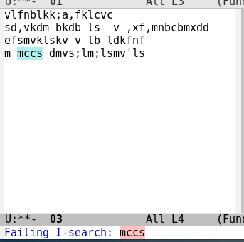

## Выводы

В ходе выполнения лабораторной работы я познакомилась с операционной системой Linux, получила практические навыки работы с редактором Emacs.

