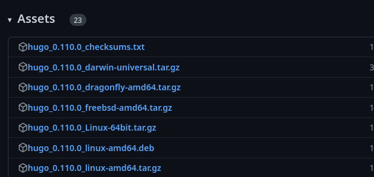
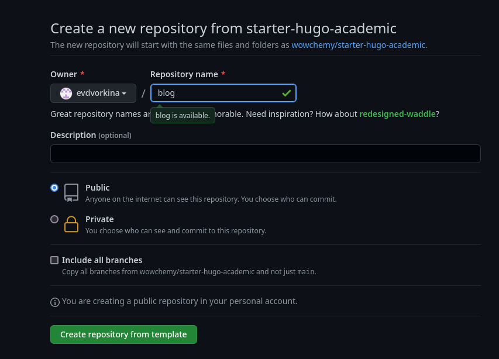
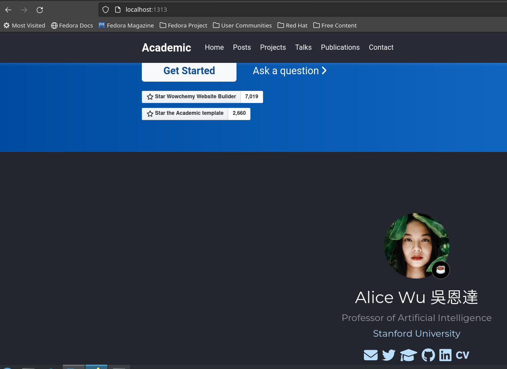
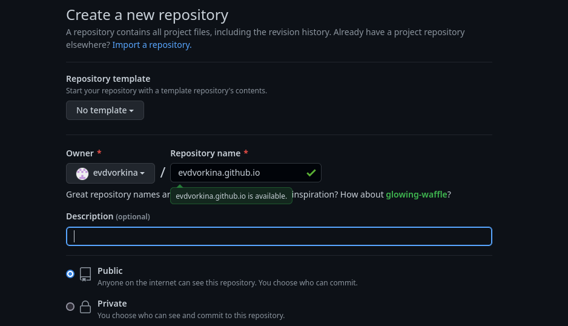
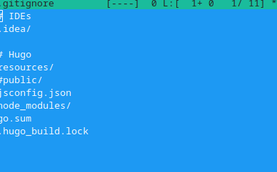
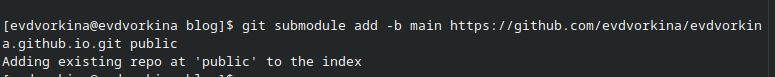
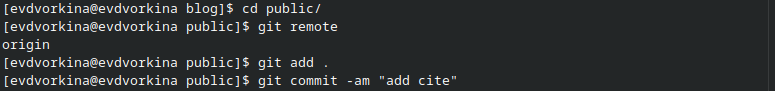

---
## Front matter
lang: ru-RU
title: Первый этап индивидуального проекта
subtitle: Операционные системы
author:
  - Двокрина Е. В,.
institute:
  - Российский университет дружбы народов, Москва, Россия
date: 25 февраля 2023

## i18n babel
babel-lang: russian
babel-otherlangs: english

## Formatting pdf
toc: false
toc-title: Содержание
slide_level: 2
aspectratio: 169
section-titles: true
theme: metropolis
header-includes:
 - \metroset{progressbar=frametitle,sectionpage=progressbar,numbering=fraction}
 - '\makeatletter'
 - '\beamer@ignorenonframefalse'
 - '\makeatother'
---

## Актуальность

Научному работнику полезно иметь сайт-портфолио про него и его проекты.

## Цель

Научиться размещать сайт на Github pages. Выполнить первый этап реализации индивидуального проекта.

## Задачи

1. Установить необходимое ПО
2. Скачать шаблон темы сайта
3. Разместить его на хостинге Git
4. Установить параметр для URLs сайта
5. Разместить заготовку сайта на Github pages.

## ПО и инструменты

- hugo (рис. 1).
- Github
- git
- Github pages

## ПО и инструменты

Создаю свой репозиторий blog (рис. 2).

## Выполнение первого этапа проекта

Получаем страницу сайта на локальном сервере (рис. 3).

## Установка параметр для URLs сайта

Создаю новый пустой репозиторий, чье имя будет адресом сайта (рис. 4).

## Установка параметр для URLs сайта

Перед тем как подключать созданный пустой репозиторйи к каталогу public из репозитория blog, нужно отключить в файле gitignore publiс (рис. 5).

## Установка параметр для URLs сайта

Подключаю репозиторий к каталогу public (рис. 6).

## Размещение заготовку сайта на Github pages.

Проверяю есть ли подключение между public и репозиторием evdvorkina.github.io, после чего отправляю изменения на глобальный репозиторий (рис. 7).

## Результаты и выводы

- Научилась размещать сайт на Github pages
- Разместила шаблон сайта на сервере

# Спасибо за внимание

