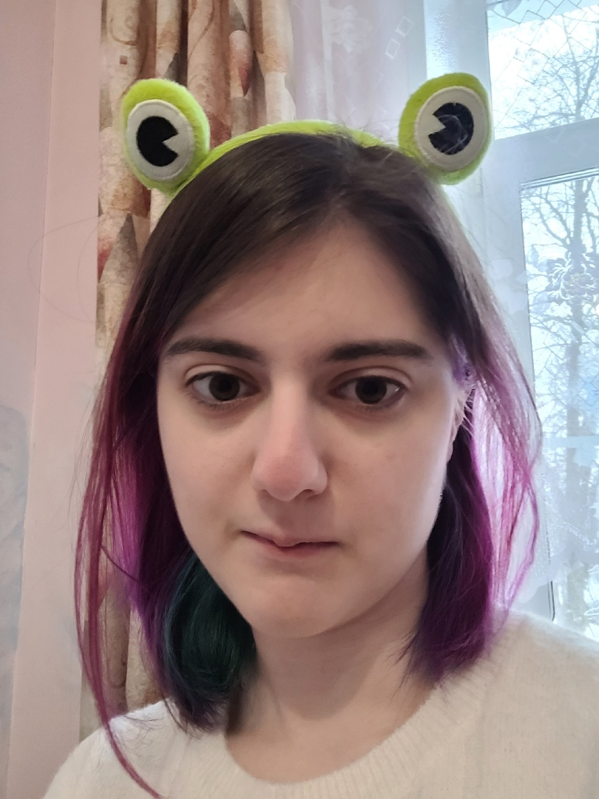

---
## Front matter
lang: ru-RU
title: Этап индивидуального проекта №4
subtitle: Операционные системы
author:
  - Дворкина Ева Владимировна
institute:
  - Российский университет дружбы народов, Москва, Россия

date: 7 апреля 2023

## i18n babel
babel-lang: russian
babel-otherlangs: english

## Formatting pdf
toc: false
toc-title: Содержание
slide_level: 2
aspectratio: 169
section-titles: true
theme: metropolis
header-includes:
 - \metroset{progressbar=frametitle,sectionpage=progressbar,numbering=fraction}
 - '\makeatletter'
 - '\beamer@ignorenonframefalse'
 - '\makeatother'
---

## Докладчик

:::::::::::::: {.columns align=center}
::: {.column width="70%"}

  * Дворкина Ева Владимировна
  * студентка из группы НКАбд-01-22
  * Факультет физико-математических и естественных наук
  * Российский университет дружбы народов
  * [1132226447@rudn.ru](mailto:1132226447@rudn.ru)
  * <https:///evdvorkina.github.io>

:::
::: {.column width="30%"}

:::
::::::::::::::
